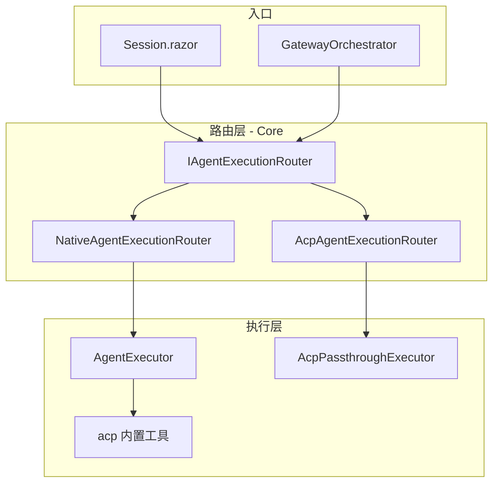

# ACP 集成指南

Seeing.Agent 通过独立包 `Seeing.Agent.Acp` 集成 [Agent Client Protocol (ACP)](https://github.com/agentclientprotocol/agent-client-protocol)，支持将外部 ACP Agent（如 OpenCode、Codex）接入 WebUI 与 Gateway。

## 架构



- **统一入口**：WebUI 与 Gateway 均注入 `IAgentExecutionRouter`，不再直接调用 `AgentExecutor`。
- **Native 默认**：`NativeAgentExecutionRouter` 在 Core 中注册，将请求转发给 `AgentExecutor`。
- **ACP 装饰**：`AcpExtension` 插件加载后，用 `AcpAgentExecutionRouter` 装饰路由，根据 Agent 的 `Runtime` 字段分流。
- **标题生成例外**：`TitleGenerationService` 仍直接使用 `AgentExecutor`（Native-only），不经过 ACP 路由。

## 两种运行模式

| 模式 | Agent `Runtime` | 行为 |
|------|-----------------|------|
| **Native + acp 工具** | `Native` | 标准 LLM 循环；LLM 可调用内置 `acp` 工具，将子任务委派给外部 ACP Agent |
| **Passthrough 透传** | `AcpPassthrough` | 跳过 `AgentExecutor` LLM 循环，直接与 ACP 后端通信，事件映射为 `IMessageEvent` |

### 切换方式

1. **切换 Agent**：在 WebUI Agent 选择器中选择自动生成的 `acp-{backendId}`（如 `acp-opencode`），或 `default`（Native + acp 工具）。
2. **配置驱动**：在 `SeeingAgent:Acp:Backends` 中增删后端，启动时会自动注册/注销对应的 Passthrough Agent（命名规则：`acp-{backendId}`）。
3. **手动覆盖（可选）**：仍可在 `SeeingAgent:Agents` 中显式定义同名 Agent 以覆盖描述、权限等；已存在的 Agent 不会被自动注册覆盖。

## 配置

### ACP 后端（`SeeingAgent:Acp`）

```json
{
  "SeeingAgent": {
    "Acp": {
      "Enabled": true,
      "DefaultBackend": "opencode",
      "RequestTimeout": "00:30:00",
      "IdleTimeout": "00:30:00",
      "Backends": {
        "opencode": {
          "Command": "C:\\Users\\<user>\\AppData\\Roaming\\npm\\opencode.cmd",
          "Args": ["acp"]
        },
        "cursor": {
          "Command": "C:\\Users\\<user>\\AppData\\Local\\cursor-agent\\agent.cmd",
          "Args": ["acp"]
        }
      }
    }
  }
}
```

| 字段 | 说明 |
|------|------|
| `Enabled` | 是否启用 ACP 集成 |
| `DefaultBackend` | 未指定 `AcpBackend` 时的默认后端 |
| `Backends` | 后端字典，key 为标识符 |
| `Backends.*.Command` | 启动 ACP 后端的可执行文件**绝对路径**（Windows 建议使用 `.cmd` / `.exe`） |
| `Backends.*.Args` | 命令行参数（如 `["acp"]`） |
| `IdleTimeout` | 子进程租约空闲超时（默认 30 分钟）；超时后自动 kill，下次对话重新启动 |

### 默认 Agent 与 ACP / Native 分流

**无需在 Gateway 节单独配置 ACP 或 Native**。在根级设置 `DefaultAgent`，系统根据 Agent 的 `Runtime` 自动分流：

| `DefaultAgent` 示例 | `Runtime` | 执行路径 |
|---------------------|-----------|----------|
| `sisyphus` | `Native` | `AgentExecutor` LLM 循环 |
| `acp-opencode` | `AcpPassthrough` | ACP 透传执行器 |

```json
{
  "SeeingAgent": {
    "DefaultAgent": "acp-opencode",
    "DefaultModel": "openai/gpt-4",
    "Acp": {
      "Enabled": true,
      "DefaultBackend": "opencode",
      "Backends": {
        "opencode": { "Command": "C:\\Users\\<user>\\AppData\\Roaming\\npm\\opencode.cmd", "Args": ["acp"] }
      }
    }
  }
}
```

`Acp.DefaultBackend` 仅用于 Native Agent 调用内置 `acp` **工具**时的默认后端，不参与 Gateway 默认 Agent 解析。

### Agent 配置（`SeeingAgent:Agents`）

Passthrough Agent **无需手动配置**，会由 `AcpDynamicAgentRegistrar` 根据 `Backends` 自动生成（例如 `opencode` → `acp-opencode`）。

`Agents` 节仍可用于 Native Agent 或手动覆盖：

```json
{
  "SeeingAgent": {
    "Agents": {
      "default": {
        "Runtime": "Native",
        "AllowedTools": ["read", "write", "grep", "glob", "bash", "acp"]
      }
    }
  }
}
```

如需自定义某个 Passthrough Agent，可显式定义同名项（如 `acp-opencode`），自动注册会跳过已存在的 Agent。

### 插件加载

开发模式（ProjectReference）：

```xml
<ProjectReference Include="../../src/Seeing.Agent.Acp/Seeing.Agent.Acp.csproj" />
```

`seeing.json` 或 `appsettings.json` 中注册插件：

```json
{
  "SeeingAgent": {
    "Plugins": ["./Seeing.Agent.Acp.dll"]
  }
}
```

启动时 `InitializeSeeingAgentAsync(workspaceRoot)` 会加载 `AcpExtension`，装饰 `IAgentExecutionRouter` 并注册 `acp` / `acp_status` 工具。

## WorkingDirectory

WebUI 与 Gateway 构建 `AgentContext` 时使用：

```
WorkingDirectory = session.WorkingDirectory ?? workspaceRoot
WorkspaceRoot    = IWorkspaceProvider.WorkspaceRoot
```

- **session.WorkingDirectory**：会话级工作目录（Fork 时继承）
- **workspaceRoot**：应用启动时传入 `InitializeSeeingAgentAsync` 的工作区根目录

ACP 后端的文件系统与 Shell 操作受此目录约束。

## 子进程租约与 Session 复用

Passthrough 模式下有两层「Session」：

| 层级 | 生命周期 | 说明 |
|------|----------|------|
| **ACP Session ID** | 跟随 Seeing Session | 存在 `Session.Metadata`，跨多轮对话复用；通过 `session/load` 恢复 Cursor/OpenCode 上下文 |
| **子进程租约** | `IdleTimeout` 内复用 | 同一 `passthrough:{backend}:{seeingSessionId}` 在空闲超时前保持 `agent.cmd` 进程常驻 |

行为摘要：

- **同 Session 连续对话**：优先复用已有子进程，不再每次 `Start → Kill`
- **超过 `IdleTimeout` 无活动**：后台任务（每分钟检查）回收子进程；ACP Session ID 仍保留，下次 `session/load` 恢复
- **删除 Seeing Session**：立即 kill 对应子进程并清除 ACP Session 映射
- **每次 Run**：重新绑定流式 sink / 权限上下文 / 工作目录，避免事件串台

```json
"Acp": {
  "IdleTimeout": "00:30:00"
}
```

## 入口接线清单

| 组件 | 执行入口 | 说明 |
|------|----------|------|
| `Session.razor` | `IAgentExecutionRouter` | WebUI 主执行循环 |
| `GatewayOrchestrator` | `IAgentExecutionRouter` | Gateway HTTP/WS 聊天 |
| `AgentBase`（配置模式） | `IAgentExecutionRouter` | 配置驱动 Agent |
| `TitleGenerationService` | `AgentExecutor` | 有意绕过路由，Native-only |

## 本地验证

```bash
# 构建 WebUI（含 ACP 插件）
dotnet build samples/Seeing.Agent.WebUI/Seeing.Agent.WebUI.csproj

# 构建 Gateway
dotnet build samples/Seeing.Gateway.Server/Seeing.Gateway.Server.csproj

# 运行 WebUI
dotnet run --project samples/Seeing.Agent.WebUI
```

### CLI 后端可用性

`Command` 必须填写本机可执行文件的绝对路径。可用 `where.exe` 查找：

```powershell
where.exe opencode
where.exe agent
```

| 后端 | 典型路径 (Windows) |
|------|-------------------|
| opencode | `%APPDATA%\npm\opencode.cmd` |
| cursor | `%LOCALAPPDATA%\cursor-agent\agent.cmd` |

验证命令：

1. 确保本机已安装 `opencode` / `codex` 且支持 `acp` 子命令
2. 在 Agent 选择器切换 `acp-opencode`，发送消息验证 Passthrough 流式输出
3. 切换 `default` Agent，验证 LLM 可调用 `acp` 工具委派

### 开发模式插件加载

- **ProjectReference 足够**：`AddSeeingAcp()` 在 `Program.cs` 中直接注册 DI 服务；`ProjectReference` 会将 `Seeing.Agent.Acp.dll` 复制到输出目录。
- **Plugins 配置**：`"Plugins": ["./Seeing.Agent.Acp.dll"]` 用于 `InitializeSeeingAgentAsync` 加载 `AcpExtension`（Hook 与工具二次注册）。开发时两者并存无害。

## 相关文件

| 路径 | 职责 |
|------|------|
| `src/Seeing.Agent/Core/Interfaces/IAgentExecutionRouter.cs` | 执行路由接口 |
| `src/Seeing.Agent/Core/NativeAgentExecutionRouter.cs` | Native 默认实现 |
| `src/Seeing.Agent.Acp/AcpExtension.cs` | 插件入口，装饰路由 |
| `src/Seeing.Agent.Acp/Routing/AcpAgentExecutionRouter.cs` | ACP 路由装饰器 |
| `samples/Seeing.Agent.WebUI/.seeing/seeing.json` | WebUI 示例配置 |
| `samples/Seeing.Agent.WebUI/.seeing/mcp.json.example` | MCP 配置模板（复制为 `mcp.json` 后填入密钥） |
